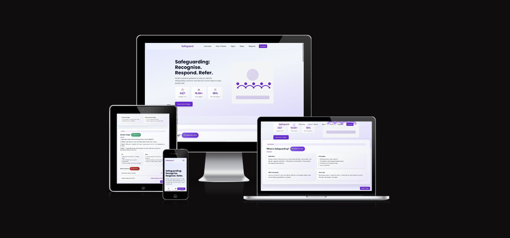

Safeguarding — Clear Guidance

A fast, accessible guide to recognising safeguarding concerns and taking the right next steps. The site focuses on clarity, speed to action, and trust — with copy-to-clipboard numbers, concise action steps, and region-specific contacts.

Live site: https://u22n.github.io/project/

Responsive Preview
[](https://ui.dev/amiresponsive?url=https://u22n.github.io/project/)

Contents
- Overview
- Features
- Color Palette
- Getting Started
- Development Notes
- Accessibility
- Acknowledgements

Overview
The project is a static, client‑side website built with HTML, Tailwind (CDN), and vanilla JavaScript. It ships with progressive enhancement: everything important works without JavaScript, and interactivity adds speed and polish.

Features
- Copy to clipboard: One‑tap copying for emergency and helpline numbers, with visual feedback.
- FAQ search: Fast, forgiving search with keyboard support and highlight emphasis.
- Regional contacts: Filter by region with a modern, accessible dropdown and instant list updates.
- Polished UI: Subtle parallax, glass/gradient surfaces, trust badges, and clean typography.
- Social cards: Open Graph + Twitter Card metadata for rich, branded sharing.
- Mobile‑first: Layouts scale smoothly from small screens to desktop.

Color Palette
Core theme colors power the gradients, focus states, and brand accents. These are defined as CSS variables in `assets/styles.css`.

```
:root {
	--brand: #6d28d9;        /* Primary */
	--brand-dark: #4c1d95;   /* Primary (dark) */
	--brand-rgb: 109,40,217; /* Helper for alpha */
	--muted: #6b7280;        /* Secondary text */
	--text: #0f172a;         /* Body text */
	--bg-body: #f8fafc;      /* Light background */
	--bg-gradient-start: #e0e7ff;
	--bg-gradient-mid:   #f1f5f9;
	--bg-gradient-end:   #ddd6fe;
}

/* Accent gradients used in badges and highlights */
/* info:   #06b6d4 → #0891b2 */
/* safe:   #10b981 → #059669 */
/* urgent: #f59e0b (hover shadows) */
```

Getting Started
You can open `index.html` directly in a browser, or run a tiny local server for a cleaner experience.

Run locally (macOS, zsh):
```
cd /Users/xovy/Documents/vsc-projects/project-1.0
python3 -m http.server 5173
# then visit http://localhost:5173
```

Project structure
```
project-1.0/
├─ index.html         # Main page
├─ contact.html       # Contact form and guidance
├─ assets/
│  ├─ styles.css      # Theme, components, responsive styles
│  └─ script.js       # Interactivity (search, copy, dropdown, etc.)
└─ README.md
```

Development Notes
- Tailwind via CDN: Utilities and layout are provided through the CDN build for zero‑config use.
- Reusable UI styles: Inputs and lists share a “glassy” look via small, reusable classes (`.input-suggestions`, `.select-suggestions`, `.email-suggestions`).
- Regional selector: The visible dropdown is a custom, accessible control synced with a hidden native select to preserve semantics and existing logic.
- Social metadata: Open Graph/Twitter tags are included in `index.html` for rich embeds (Discord, Twitter, etc.).

Accessibility
- Keyboard support: The region list supports Enter/Space selection and closes on outside click.
- Focus styles: High‑contrast focus rings use brand color with softened alpha for clarity without glare.
- Semantics: Headings, labels, and ARIA attributes help assistive technologies navigate the page.

Acknowledgements
- Built by hand with HTML, Tailwind, and vanilla JavaScript.
- AI pair‑assistance: An AI assistant helped debug issues, consolidate patterns, and refactor certain UI behaviors (e.g., searchable dropdown and reusable input styles). All changes were reviewed and integrated intentionally.

Contributing
Suggestions are welcome — open an issue or a PR with a concise description and screenshot of the change. Keep the tone calm, the UI minimal, and the performance light.
